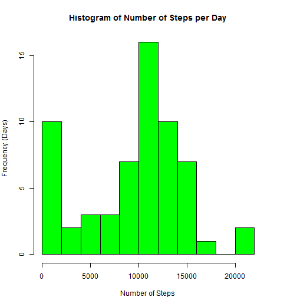
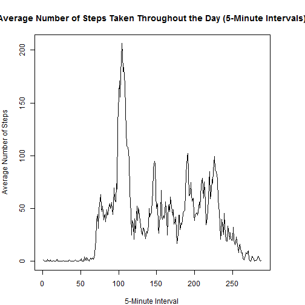
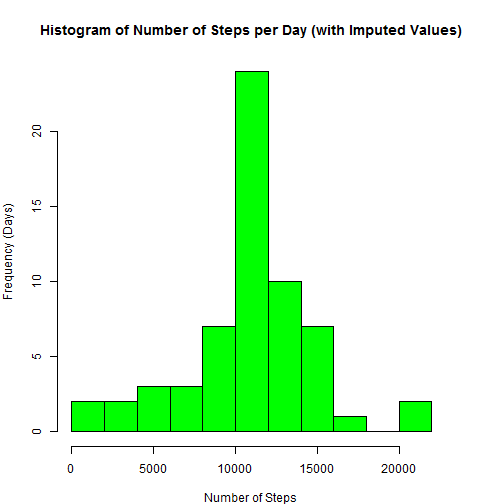
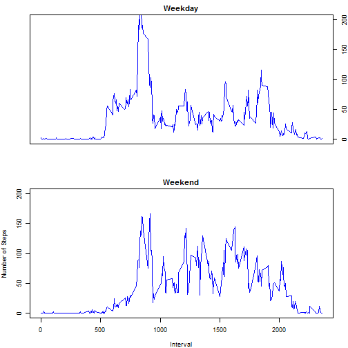

## Reproducible Research Assignment 1

# Loading and Preprocessing the Data

Set working directory


```r
setwd("~/Training/Coursera/Reproducible Research/Assignment 1")
```

Load R Packages


```
## Warning: package 'markdown' was built under R version 3.2.3
```

```
## Warning: package 'xtable' was built under R version 3.2.3
```

```
## Warning: package 'plyr' was built under R version 3.2.3
```

```
## Warning: package 'ggplot2' was built under R version 3.2.2
```

```
## Warning: package 'lattice' was built under R version 3.2.2
```

```
## Warning: package 'lubridate' was built under R version 3.2.2
```

```
## 
## Attaching package: 'lubridate'
## 
## The following object is masked from 'package:plyr':
## 
##     here
```
Load the activity data


```r
data <- read.csv("activity.csv")
```

Process the activity data


```r
data$steps <- as.numeric(data$steps)
data$interval <- as.numeric(data$interval)
data$date <- as.Date(data$date, format="%Y-%m-%d")
```

# Find the Mean Total Number of Steps Taken per Day


```r
table1 <- tapply(data$steps,data$date,sum,na.rm=TRUE)

numdays <- length(table1)
total <- sum(data$steps,na.rm=TRUE)

avg <- total / numdays
med <- median(table1)

total2 <- format(total,scientific=FALSE,big.mark=",",digits=0)
avg2 <- format(avg,scientific=FALSE,big.mark=",",digits=0)
med2 <- format(med,scientific=FALSE,big.mark=",",digits=0)

par(mar=c(4,4,4,4),cex=1.0)
plot1 <- hist(table1,col="green",breaks=10,xlab="Number of Steps",ylab="Frequency (Days)",main="Histogram of Number of Steps per Day")
```

 

The total number of steps taken is 570,608.
The average number of steps taken per day is 9,354.
The median number of steps taken is 10,395.

# What is the average daily activity pattern?


```r
table2 <- tapply(data$steps,data$interval,mean,na.rm=TRUE)

par(mar=c(4,4,4,4),cex=1.0)
plot2 <- plot(table2,type='l',xlab="5-Minute Interval",ylab="Average Number of Steps",main="Average Number of Steps Taken Throughout the Day (5-Minute Intervals)")
```

 

```r
maxInterval <- max(table2)
pos <- match(maxInterval,table2)
```

The 5-minute interval with the greatest number of steps takend is the 104th interval

# Imputing missing values


```r
missing <- sum(is.na(data$steps))
missing2 <- format(missing,scientific=FALSE,big.mark=",",digits=0)
```

The total number of missing values is 2,304.

In order to impute the missing values, the average of the number of steps taken at the same time interval on different days was calculated.  This average was used in place of the missing value.


```r
rows <- nrow(data)
cols <- ncol(data)

ImputedData <- data.frame(matrix(0,ncol=cols,nrow=rows))
ImputedData <- data

range <- 1:rows

for (i in range) {
    if(is.na(data[i,1]==TRUE)) {
        SelInterval <- data[i,3]
        subset <- data[data$interval==SelInterval,]
        ImputedData[i,1] <- mean(subset$steps,na.rm=TRUE)
    } else {
    }
}

table3 <- tapply(ImputedData$steps,ImputedData$date,sum,na.rm=TRUE)

numdays2 <- length(table3)
total2 <- sum(ImputedData$steps,na.rm=TRUE)

avg2 <- total2 / numdays2
med2 <- median(table3)

par(mar=c(4,4,4,4),cex=1.0)
plot3 <- hist(table3,col="green",breaks=10,xlab="Number of Steps",ylab="Frequency (Days)",main="Histogram of Number of Steps per Day (with Imputed Values)")
```

 

```r
totaldiff <- total2 - total
avgdiff <- avg2 - avg
meddiff <- med2 - med

totaldiff2 <- format(totaldiff,scientific=FALSE,big.mark=",",digits=0)
avgdiff2 <- format(avgdiff,scientific=FALSE,big.mark=",",digits=0)
meddiff2 <- format(meddiff,scientific=FALSE,big.mark=",",digits=0)
```

After imputing the missing values, the total, average and median number of steps changed as follows:

The difference in total number of steps taken is 86,130.
The difference in the average number of steps taken per day is 1,412.
The difference in the median number of steps taken per day is 371.

# Differences in activity patterns between weekdays and weekends


```r
ImputedData$dayofweek <- factor(range,levels = c("Weekend","Weekday"))

for (i in range) {
    if(weekdays(ImputedData[i,2])=="Saturday") {
        ImputedData[i,4] <- factor(c("Weekend"))
    } else if(weekdays(ImputedData[i,2])=="Sunday") {
        ImputedData[i,4] <- factor(c("Weekend"))
    } else {
        ImputedData[i,4] <- factor(c("Weekday"))
    }
}

subsetWeekend <- ImputedData[ImputedData$dayofweek=="Weekend",]
subsetWeekday <- ImputedData[ImputedData$dayofweek=="Weekday",]

IntervalWeekend <- ddply(subsetWeekend,c("interval"),summarize,steps=mean(steps))
IntervalWeekday <- ddply(subsetWeekday,c("interval"),summarize,steps=mean(steps))

par(mfrow=c(2,1))
par(mar=c(4,4,2,2),cex=0.75)

with(IntervalWeekday,plot(interval,steps,type="n",axes=FALSE,xlab="",ylab="",main="Weekday",ylim=c(0,200)))
lines(IntervalWeekday$interval,IntervalWeekday$steps,col="blue")
axis(4)
box()
with(IntervalWeekend,plot(interval,steps,type="n",xlab="Interval",ylab="Number of Steps",main="Weekend",ylim=c(0,200)))
lines(IntervalWeekend$interval,IntervalWeekend$steps,col="blue")
```

 
